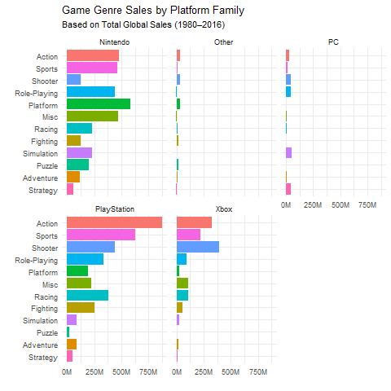
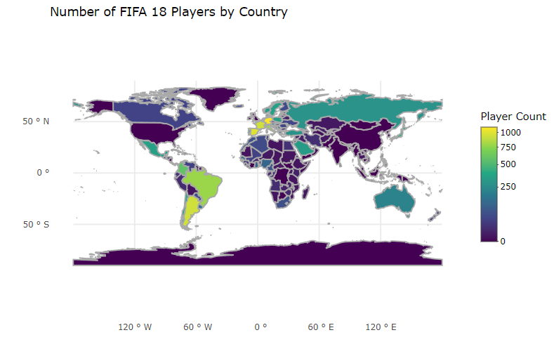
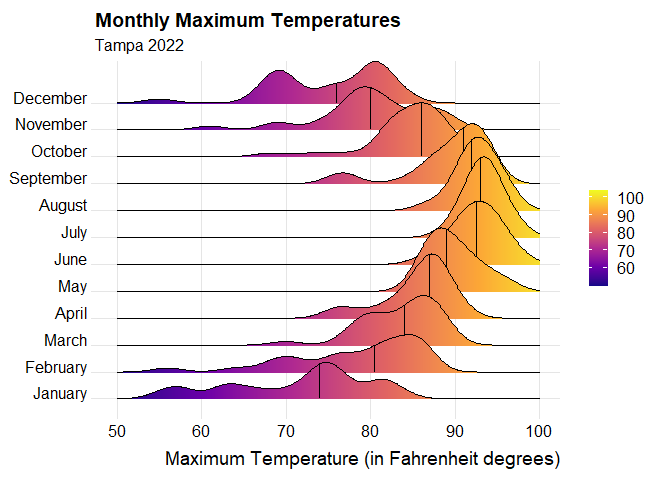

# Data Visualization and Reproducible Research

> Jessica Rangel 
Florida Polytechnic University Summer A 2025

The following is a sample of products created during the _"Data Visualization and Reproducible Research"_ course.

## Project 01 - Video Game Sales

In the `project_01/` folder you can find data visualizations exploring the "Video Game Sales" dataset, where we look at numbers per console family, genre, and regional preferences.

Analyzing sales data offers valuable insights into market trends, consumer preferences, and the impact of various factors on game performance. 

**Data:**
- Name
- Platform
- Year
- Genre
- Publisher
- NA_Sales
- EU_Sales
- JP_Sales
- Other_Sales
- Global_Sales

**Findings:**
- Xbox and PlayStation focusing more on **Shooter**, **Action**, and **Sports** makes them direct competitors; therefore a gamer who owns one console family will likely not buy the other.
- Nintendo leading in more genres such as **Platform** and **Racing**. Because of a different focus, they may attract the same gamers that will either own PlayStation or Xbox as well.
- Certain successful games/genres like are exclusive to PC, likely because of the reliance on keyboard and mouse rather than being able to port to controller usage.
- **Action** and **Sports** games dominated global sales, making them very attractive genres for developers.
- **Shooter** games were strong contenders in North America, less so in Europe. This genre has virtually no market in Japan by comparison, and so such developers should focus on Western audiences.
- **Strategy**, **Puzzle**, and **Adventure** were more niche, with smaller but notable audiences, particularly in the PC platform for many of them.
- **Role-Playing** games are by far the most favored genre in Japan, with a noticeable but still smaller audience in Europe and North America.

**Sample data visualization:** 

## Project 02 - Fifa 18 Players

In the `project_02/` folder you can find a mini project where I explored aspects of the Fifa 18 video game's players, such as nationality, overall rating and personal statistics.

The FIFA series by EA Sports is renowned for its realistic simulation of soccer, offering players detailed representations of real-world athletes.
This dataset serves as a valuable resource for analyzing player attributes, understanding the virtual representation of the sport's talent and understanding scoring metrics.

**Data:**
- Personal Information: Name, nationality, club, age
- Performance Ratings
- Physical and Technical Attributes: Acceleration, agility, balance, etc
- Goalkeeping Attributes
- Preferred Positions

**Findings:**
- Brazil, Germany, Argentina, Spain, and France seem to among the countries with more players. This was predictable, as they are well known for soccer as a dominant sport in their cultures.
- Countries with more players tend to have players with better ratings. This could indicate their commitment to investing in quality talent. However, this is not a rule, as there are countries with few players and top talent.
- Top talent tends to have higher overall ratings based on some core attributes.

**Sample data visualization:** 

## Project 03

In the `project_03/` there is the last project where I explored how to replicate complex graphs, especially under the concept of data reproducibility given only a data file.

**Sample data visualization:** 

### Moving Forward

I greatly enjoyed learning how to make meaningful visualizations and understand better how to transform data into information.

The concept of "storytelling" helps me understand what is meaningful in the plots I provide, as well as try to see from the point of view of the reader and express an idea step by step.
