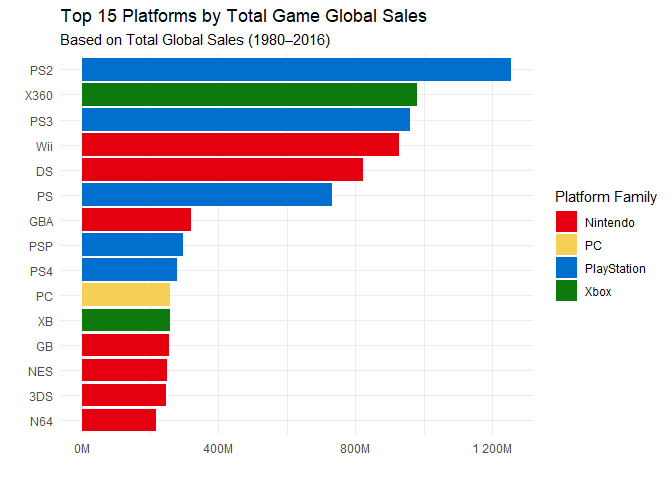
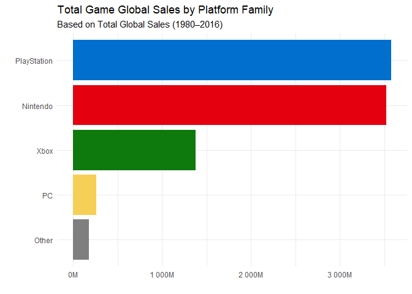
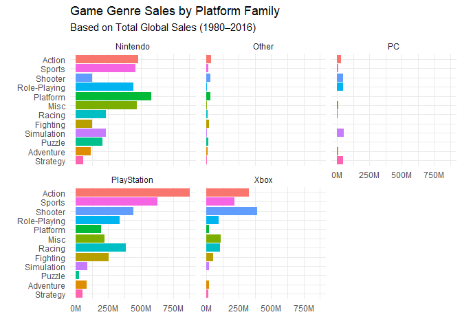
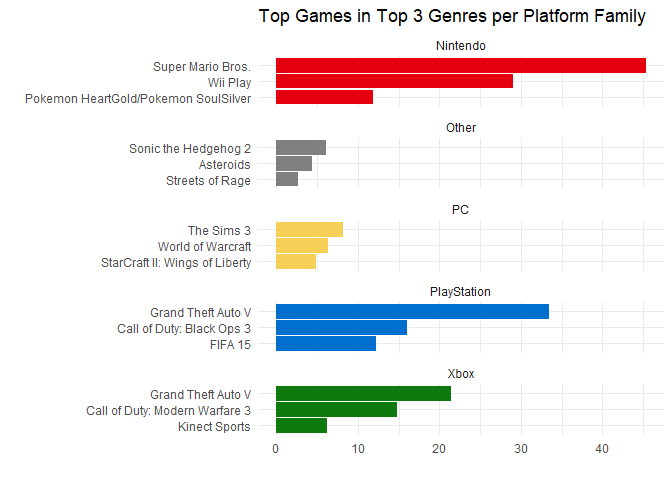
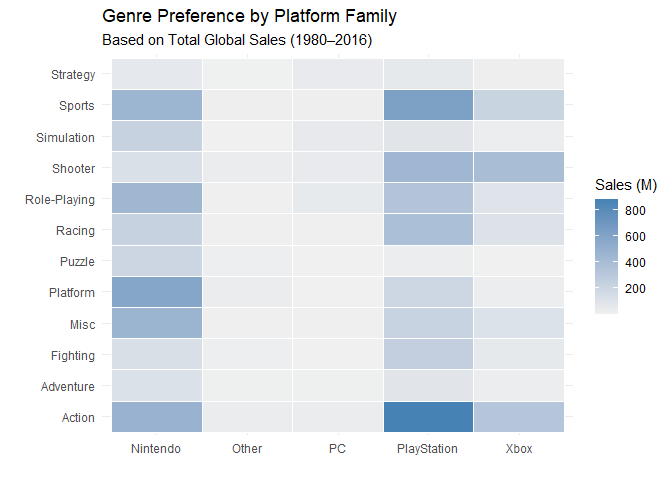
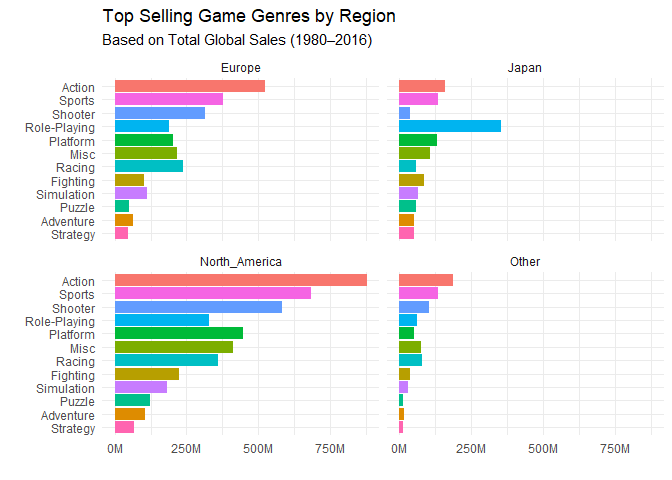
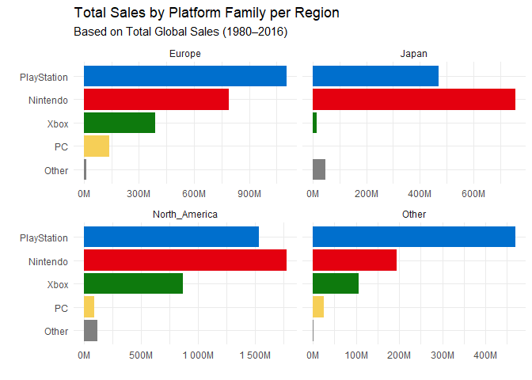

--- 

# Video Game Sales Analysis Report

**Dataset:** [Video Game Sales Dataset – GitHub](https://github.com/aalhamadani/datasets/raw/refs/heads/main/video_game_sales.csv)

**Tools:** R with Tidyverse library

Originally, I planned to build the following charts:

1. **Sales by Genre**
2. **Sales by Region**
3. **Sales per Platform Family**
4. **Genre Popularity by Platform Family**
5. **Genre Popularity by Region**

As the project progressed, these charts were refined and expanded with more dimensions (such as faceting by region, adding proportional views, customizing colors).

## Findings from the data

Considering platform families instead of specific consoles, **Nintendo** has the highest global sales, followed by **PlayStation** and **Xbox**.

A breakdown of genres most sold for each shows:

  - Xbox and PlayStation focusing more on **Shooter**, **Action**, and **Sports** makes them direct competitors; therefore a gamer who owns one console family will likely not buy the other.
  - Nintendo leading in more genres such as **Platform** and **Racing**. Because of a different focus, they may attract the same gamers that will either own PlayStation or Xbox as well.
  - Certain successful games/genres like are exclusive to PC, likely because of the reliance on keyboard and mouse rather than being able to port to controller usage.
  
If we want to look at regional differences,

- **Action** and **Sports** games dominated global sales, making them very attractive genres for developers.
- **Shooter** games were strong contenders in North America, less so in Europe. This genre has virtually no market in Japan by comparison, and so such developers should focus on Western audiences.
- **Strategy**, **Puzzle**, and **Adventure** were more niche, with smaller but notable audiences, particularly in the PC platform for many of them.
- **Role-Playing** games are by far the most favored genre in Japan, with a noticeable but still smaller audience in Europe and North America.

Clear patterns emerged: Nintendo dominates **Platform** games, thus doing well in Japan, Xbox leads in **Shooter** games, thus performing best in North America, and PlayStation heavily favors **Action**, with a great audience in all regions.

### Data Visualization & Design Principles Applied

In accordance to the *Glamour of Graphics* principles, I sought to minimize visual clutter and flip the coordinates wherever it helped with legibility. 

- `facet_wrap()` allowed breaking charts into smaller panels by region or family. This made cross-region comparisons straightforward.
- `reorder()` to sort genres/platforms by descending sales.
- `scale_fill_manual()` assigned the official colors of each platform for when the plot was organized by console family.
- `label_number(suffix = "M")` to format numbers cleanly in millions.
- **Bar Charts**: To rank and compare total sales.
- **Heatmap**: To compare genre/platform combinations across categories.
- **Facets**: To separate comparisons by region or family without clutter.

I also wanted to account for certain aspects of the data that could be helpful:

- Aggregating platform families reduced noise and improved readability. Most of the platforms depicted are not available for sale anymore, and so following a trend over time might help more than looking at single points in time.
- Western markets dominated in total sales volume, while Japan showed distinct preferences. They need to be treated as very distinct markets.
- Sometime a normalized graph (showing percentage rather than absolute numbers) might be better for comparisons.

### Conclusion

- **Nintendo dominates** total sales and child/family-focused genres.
- **Genre preferences are region-specific**, requiring tailored publishing strategies.
- **Flagship franchises** play a massive role in overall platform success, at times being the single most defining success of a brand.
- **Heatmaps and facet plots** are powerful tools for exploring multi-dimensional categorical data.

The story we can tell is understanding player preferences, knowing your audience, and how to make a game more likely to be successful. Now, what made individual games special and best-selling is worth its own study.

### Ideas for further research

- Add a **time** dimension to explore trends over decades.
- Conduct a **publisher-level analysis** to evaluate brand strength.
- Evaluate **player preferences** within each genre (gameplay feature, mechanics, multiplayer, etc.)

---

## Loading data


``` r
library(tidyverse)

videogameSalesDataset = read_csv("../data/video_game_sales.csv", col_types = cols())

videogameSalesDataset
```

```
## # A tibble: 16,598 × 10
##    Name    Platform Year  Genre Publisher NA_Sales EU_Sales JP_Sales Other_Sales
##    <chr>   <chr>    <chr> <chr> <chr>        <dbl>    <dbl>    <dbl>       <dbl>
##  1 Wii Sp… Wii      2006  Spor… Nintendo      41.5    29.0      3.77        8.46
##  2 Super … NES      1985  Plat… Nintendo      29.1     3.58     6.81        0.77
##  3 Mario … Wii      2008  Raci… Nintendo      15.8    12.9      3.79        3.31
##  4 Wii Sp… Wii      2009  Spor… Nintendo      15.8    11.0      3.28        2.96
##  5 Pokemo… GB       1996  Role… Nintendo      11.3     8.89    10.2         1   
##  6 Tetris  GB       1989  Puzz… Nintendo      23.2     2.26     4.22        0.58
##  7 New Su… DS       2006  Plat… Nintendo      11.4     9.23     6.5         2.9 
##  8 Wii Pl… Wii      2006  Misc  Nintendo      14.0     9.2      2.93        2.85
##  9 New Su… Wii      2009  Plat… Nintendo      14.6     7.06     4.7         2.26
## 10 Duck H… NES      1984  Shoo… Nintendo      26.9     0.63     0.28        0.47
## # ℹ 16,588 more rows
## # ℹ 1 more variable: Global_Sales <dbl>
```

---

# Data investigation

## Global sales by platform

Knowing which popular platforms give an idea of where a publisher should make their product available for purchase. Generally, games are multiplatform, being available in most, if not all, current generation hardware. However, some companies have exclusivity contracts, timed or no, with certain families. This chart would give an idea of the size of the potential audience, and whether console exclusivity should be considered.

### Game sales per platform totals

The **PlayStation 2** is the undisputed leader in game sales. It is no longer in production, being followed by the PlayStation 3, and then the PlayStation 4 and 5. The decrease in game sales could be due to increase in cost and decrease in consumer spending, the rise of mobile platforms, less releases because of production costs, or other reasons. The dataset does not give enough information regarding that.


``` r
# Adding a new variable to add clarity on color per platform family
videogameSalesDatasetPerFamily = videogameSalesDataset %>%
  mutate(Platform_Family = case_when(
    str_starts(Platform, "PS") ~ "PlayStation",
    Platform %in% c("X360", "XB", "XOne") ~ "Xbox",
    Platform %in% c("Wii", "WiiU", "DS", "3DS", "Switch", "GBA", "GC", "GB", "SNES", "NES", "N64") ~ "Nintendo",
    Platform == "PC" ~ "PC",
    TRUE ~ "Other"
  ))

# Create plot
videogameSalesDatasetPerFamily %>%
  group_by(Platform, Platform_Family) %>%
  
  # summarize total sales ignoring NA values,
  summarize(Total_Global_Sales = sum(Global_Sales, na.rm = TRUE), .groups = "drop") %>%
  
  # Most sold at top
  arrange(desc(Total_Global_Sales)) %>%
  
  # Only print out 15 top platforms
  slice_head(n = 15) %>%
  
  # reorder is used to arrange by sales
  ggplot(aes(x = reorder(Platform, Total_Global_Sales),
             y = Total_Global_Sales,
             fill = Platform_Family)) +
  geom_col() +
  coord_flip() +
  labs(
    title = "Top 15 Platforms by Total Game Global Sales",
    subtitle = "Based on Total Global Sales (1980–2016)",
    x = " ",
    y = " ",
    fill = "Platform Family"
  ) +
        scale_fill_manual(
    values = c(
      "PlayStation" = "#006FCD",
      "Xbox"        = "#0e7a0d",
      "Nintendo"    = "#E4000f",
      "PC"          = "#F6CF57"    
    )
  ) +
  scale_y_continuous(labels = scales::label_number(scale = 1, suffix = "M")) +
  theme_minimal()
```

<!-- -->

### Are certain platform families more popular?

We can merge the data into platform *families* rather than individual consoles to have a better idea of trends.

The two most well sold families are **PlayStation** and **Nintendo**. Given that best-selling PlayStation consoles are for home use (need a stationary position and TV setup), and Nintendo consoles now focuses on handhelds (mobile, no fixed setup needed), it is clear they are not direct competitors, and consumers may be willing to own both. This proves true as the new Nintendo Switch follows the handheld trend while *enabling* but not forcing a fixed setup, thus keeping its spot as the only major handheld brand.


``` r
videogameSalesDatasetPerFamily %>%
  # Group by Platform_Family only (not Platform)
  group_by(Platform_Family) %>%
  
  # Summarize total sales per platform family
  summarize(Total_Global_Sales = sum(Global_Sales, na.rm = TRUE), .groups = "drop") %>%
  
  # Arrange in descending order of total sales
  arrange(desc(Total_Global_Sales)) %>%
  
  # Plot total sales by platform family
  ggplot(aes(x = reorder(Platform_Family, Total_Global_Sales),
             y = Total_Global_Sales,
             fill = Platform_Family)) +
  geom_col(show.legend = FALSE) +
  scale_y_continuous(labels = scales::label_number(suffix = "M")) +
  coord_flip() +
  labs(
    title = "Total Game Global Sales by Platform Family",
    subtitle = "Based on Total Global Sales (1980–2016)",
    x = " ",
    y = " "
  ) +
      scale_fill_manual(
    values = c(
      "PlayStation" = "#006FCD",
      "Xbox"        = "#0e7a0d",
      "Nintendo"    = "#E4000f",
      "PC"          = "#F6CF57"    
    )
  ) +
  theme_minimal()
```

<!-- -->

With this data, we learn that games published in PlayStation and Nintendo platforms are likely to be exposed to a very large audience, increasing its chances of good sales numbers.

## Sales based on genre

Knowing which genres are most popular could help a publisher know which projects to prioritize. This chart shows that **Action** games are the undisputed best-sellers, followed by **Sports** and **Shooter** games. **Puzzle**, **Adventure**, and **Strategy** still have good sales numbers but are considerably more niche. Their audience is smaller, and so a publisher needs to consider carefully investments in those areas. There are many incredibly mainstream and popular games from those categories (such as Portal 2), but any development team needs to consider more carefully how to set their product for success.


``` r
videogameSalesDataset %>%
  group_by(Genre) %>%
  summarize(
    Game_Count = n(),
    Total_Global_Sales = sum(Global_Sales, na.rm = TRUE)
  ) %>%
  arrange(desc(Total_Global_Sales)) %>%
  ggplot(aes(x = reorder(Genre, Total_Global_Sales), y = Total_Global_Sales, fill = Genre)) +
  geom_col(show.legend = FALSE) +
  coord_flip() +
  scale_y_continuous(labels = scales::label_number(suffix = "M")) +
  labs(
    title = "Total Game Global Sales by Genre",
    x = "",
    y = ""
  ) +
  scale_y_continuous(labels = scales::label_number(suffix = "M")) +
  theme_minimal()
```

```
## Scale for y is already present.
## Adding another scale for y, which will replace the existing scale.
```

<!-- -->

### Are some genres more popular on certain platform families?

We can see that certain platform families attract gamers that prefer certain genres. **Action** is popular in **Nintendo**, however it is clearly the dominating favorite in **PlayStation**. This seems true considering its most popular games are first-party exclusives such as *Uncharted* and *God of War*. **Xbox** does boast **Action**, but **Shooters** are far more popular. This is clear in its exclusivity of the *Halo* series, which spearheaded the platform family. **Nintendo** has a more varied audience; it favors **Platformer** games, with clear winners in the *Mario* and *Legend of Zelda* series, and **Sports** with *Wii Sports*, currently the third best selling game of all time.


``` r
videogameSalesDatasetPerFamily %>%
  group_by(Platform_Family, Genre) %>%
  summarize(Total_Global_Sales = sum(Global_Sales, na.rm = TRUE), .groups = "drop") %>%
  ggplot(aes(x = reorder(Genre, Total_Global_Sales), y = Total_Global_Sales, fill = Genre)) +
  geom_col(show.legend = FALSE) +
  coord_flip() +
  facet_wrap(~ Platform_Family) +
  scale_y_continuous(labels = scales::label_number(suffix = "M")) +
  labs(
    title = "Game Genre Sales by Platform Family",
    subtitle = "Based on Total Global Sales (1980–2016)",
    x = "",
    y = ""
  ) +
  theme_minimal()
```

<!-- -->

To visualize that, a chart with the best sellers per platform per genre can be constructed. We can notice that **PlayStation** and **Xbox** are clearly mutually exclusive competitors, while other platforms may take advantage of the fact and sell well by focusing on other genres. *GTAV* is the second best selling game of all time, and it was clearly favored by the **PlayStation** audience.

**PC** also does better with its own exclusives, such as *StarCraft II*, *Guild Wars II* or *World of Warcraft*. Those games are optimized for a keyboard/mouse setup and are not available or possible in console due to its controller requirement. These games show that that kind of genre (strategy, etc) only is feasible targeting a PC audience.


``` r
# Find top 3 genres per platform family
topGenresPerFamily = videogameSalesDatasetPerFamily %>%
  group_by(Platform_Family, Genre) %>%
  summarize(Total_Global_Sales = sum(Global_Sales, na.rm = TRUE), .groups = "drop") %>%
  group_by(Platform_Family) %>%
  slice_max(order_by = Total_Global_Sales, n = 3, with_ties = FALSE) %>%
  ungroup()

# Find top game per (Platform_Family, Genre)
topGames <- videogameSalesDatasetPerFamily %>%
  semi_join(topGenresPerFamily, by = c("Platform_Family", "Genre")) %>%
  group_by(Platform_Family, Genre, Name) %>%
  summarize(Total_Global_Sales = sum(Global_Sales, na.rm = TRUE), .groups = "drop") %>%
  group_by(Platform_Family, Genre) %>%
  slice_max(order_by = Total_Global_Sales, n = 1, with_ties = FALSE) %>%
  ungroup()

# Plot
ggplot(topGames, aes(x = reorder(Name, Total_Global_Sales),
                      y = Total_Global_Sales,
                      fill = Platform_Family)) +
  geom_col(show.legend = FALSE) +
  coord_flip() +
  
  # Rather than forcing all panels to share the same y-axis range, each one will scale independently based on its own data.
  facet_wrap(~ Platform_Family, scales = "free_y", ncol=1) +
  labs(
    title = "Top Games in Top 3 Genres per Platform Family",
    x = " ",
    y = " "
  ) +
      scale_fill_manual(
    values = c(
      "PlayStation" = "#006FCD",
      "Xbox"        = "#0e7a0d",
      "Nintendo"    = "#E4000f",
      "PC"          = "#F6CF57"    
    )
  ) +
  theme_minimal()
```

<!-- -->

### Do console families focus on specific genres?

Analyzing sales per console (platform) per genre is a powerful way to understand which game types perform best on which systems.


``` r
# Aggregate global sales by Platform_Family and Genre
heatmapGenrePerFamily = videogameSalesDatasetPerFamily %>%
  group_by(Platform_Family, Genre) %>%
  summarize(Total_Global_Sales = sum(Global_Sales, na.rm = TRUE), .groups = "drop")

# Plot heatmap
ggplot(heatmapGenrePerFamily, aes(x = Genre,
                                  y = Platform_Family,
                                  fill = Total_Global_Sales)) +
  geom_tile(color = "white") +
  scale_fill_gradient(low = "#f0f0f0",
                      high = "steelblue",
                      name = "Sales (M)") +
  labs(
    title = "Genre Preference by Platform Family",
    subtitle = "Based on Total Global Sales (1980–2016)",
    x = " ",
    y = " "
  ) +
  theme_minimal() +
  coord_flip()
```

<!-- -->

## Regional comparison

### Does each sales region prefer a certain genre?

We see a discrepancy here between regions. While **North America** and **Europe** share very similar preferences in **Action** and **Sports** games, we can see the Europeans favor **Racing**, while Americans vastly favor **Shooters** and **Platformer**. **Japan** is a clear outlier in that its gamers prefer **Role-Playing** games far more than any other genre. This is a given, as its most popular RPG franchises such as *Final Fantasy* remain best sellers there, while **Shooters** do not sell nearly as well as any other region.

**North America** is a huge market, accounting for most games sales overall.


``` r
videogameSalesDataset %>%
  group_by(Genre) %>%
  summarize(
    North_America = sum(NA_Sales, na.rm = TRUE),
    Europe = sum(EU_Sales, na.rm = TRUE),
    Japan = sum(JP_Sales, na.rm = TRUE),
    Other = sum(Other_Sales, na.rm = TRUE),
    .groups = "drop"
  ) %>%
  pivot_longer(-Genre, names_to = "Region", values_to = "Sales") %>%
  ggplot(aes(x = reorder(Genre, Sales), y = Sales, fill = Genre)) +
  geom_col(show.legend = FALSE) +
  coord_flip() +
  facet_wrap(~ Region) +
  labs(
    title = "Top Selling Game Genres by Region",
    subtitle = "Based on Total Global Sales (1980–2016)",
    x = "",
    y = ""
  ) +
  scale_y_continuous(labels = scales::label_number(suffix = "M")) +
  theme_minimal()
```

<!-- -->

### Does each region prefer a certain platform?

**Xbox**'s bigger audience is in **North America**, perhaps due to being an American company (Microsoft) with a best-selling exclusive in *Halo*, which belongs to a genre (**Shooter**) more favored by Americans than any other. It has nearly no presence in **Japan** for likely that same reason, as **Shooters** do not sell well there in general.

Japanese platforms **PlayStation** (Sony) and **Nintendo** have a solid footing in **Japan**, and also remain the top sellers in other regions. 

**PC** is best favored by **Europeans** but also has its audience in **North America**. This is likely due to the game genres available.

As **Xbox** is generally mutually exclusive with **PlayStation** by competing in selling the same games, if **PlayStation** is favored, Xbox will not sell well.


``` r
# Step 2: Aggregate and reshape
videogameSalesDatasetPerFamily %>%
  group_by(Platform_Family) %>%
  summarize(
    North_America = sum(NA_Sales, na.rm = TRUE),
    Europe = sum(EU_Sales, na.rm = TRUE),
    Japan = sum(JP_Sales, na.rm = TRUE),
    Other = sum(Other_Sales, na.rm = TRUE),
    .groups = "drop"
  ) %>%
  pivot_longer(-Platform_Family, names_to = "Region", values_to = "Sales") %>%
  ggplot(aes(x = reorder(Platform_Family, Sales), y = Sales, fill = Platform_Family)) +
  geom_col(show.legend = FALSE) +
  coord_flip() +
  facet_wrap(~ Region, scales = "free_x") +
  labs(
    title = "Total Sales by Platform Family per Region",
    subtitle = "Based on Total Global Sales (1980–2016)",
    x = " ",
    y = " "
  ) +
  scale_y_continuous(labels = scales::label_number(suffix = "M")) +
    scale_fill_manual(
    values = c(
      "PlayStation" = "#006FCD",
      "Xbox"        = "#0e7a0d",
      "Nintendo"    = "#E4000f",
      "PC"          = "#F6CF57"    
    )
  ) +
  theme_minimal()
```

<!-- -->

---


``` r
# Group by Platform and count unique titles
unique_titles_by_platform <- videogameSalesDataset %>%
  group_by(Platform) %>%
  summarise(Unique_Titles = n_distinct(Name)) %>%
  arrange(desc(Unique_Titles))

# View the result
print(unique_titles_by_platform)
```

```
## # A tibble: 31 × 2
##    Platform Unique_Titles
##    <chr>            <int>
##  1 DS                2163
##  2 PS2               2161
##  3 PS3               1327
##  4 Wii               1324
##  5 X360              1264
##  6 PSP               1213
##  7 PS                1196
##  8 PC                 959
##  9 XB                 824
## 10 GBA                822
## # ℹ 21 more rows
```


