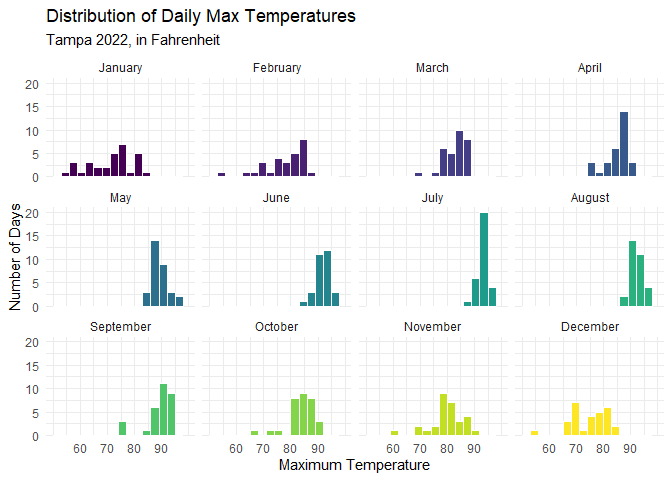
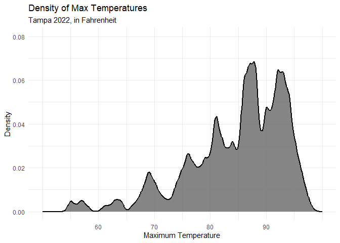
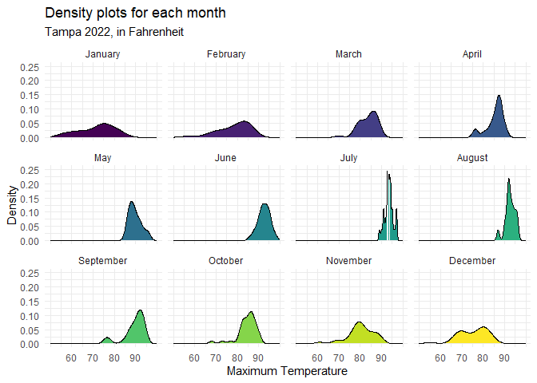
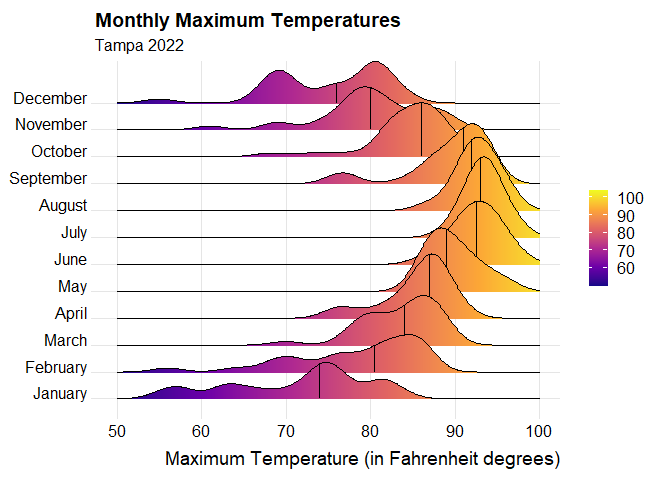
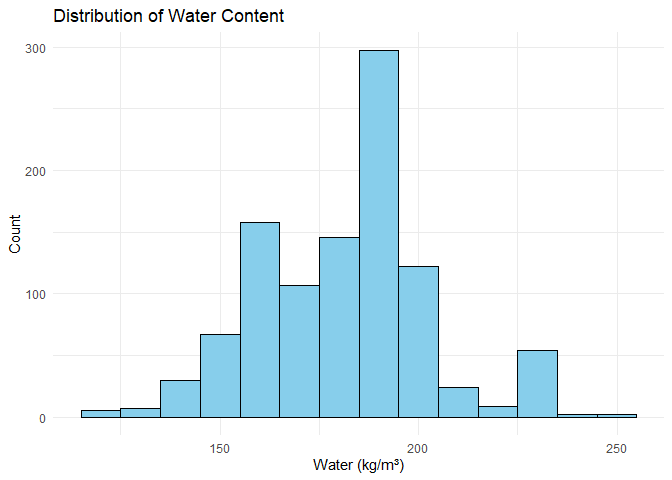
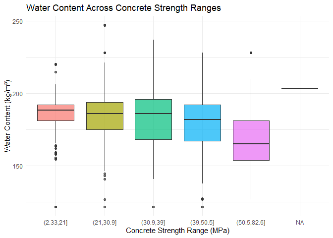
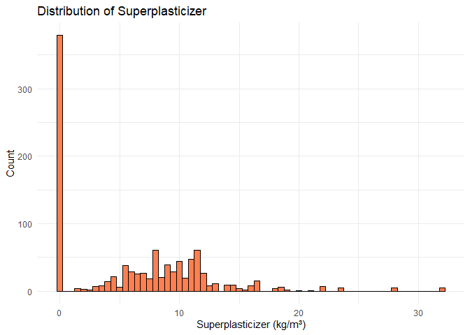
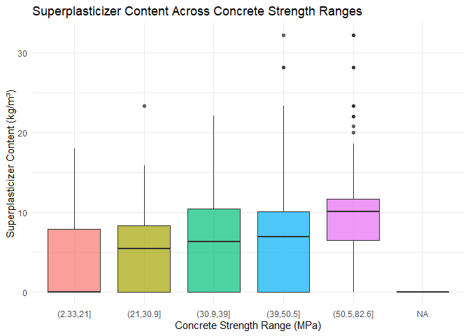
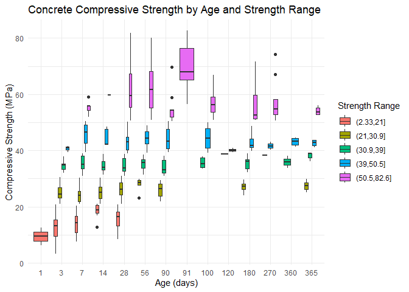
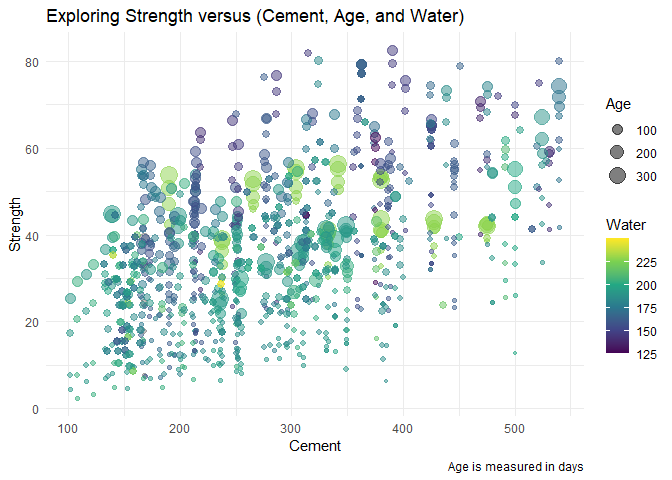

# Data Visualization Project 03


In this exercise you will explore methods to create different types of data visualizations (such as plotting text data, or exploring the distributions of continuous variables).


## PART 1: Density Plots

Using the dataset obtained from FSU's [Florida Climate Center](https://climatecenter.fsu.edu/climate-data-access-tools/downloadable-data), for a station at Tampa International Airport (TPA) for 2022, attempt to recreate the charts shown below which were generated using data from 2016. You can read the 2022 dataset using the code below: 


``` r
library(tidyverse)
weather_tpa <- read_csv("https://raw.githubusercontent.com/aalhamadani/datasets/master/tpa_weather_2022.csv")
# random sample 
sample_n(weather_tpa, 4)
```

```
## # A tibble: 4 × 7
##    year month   day precipitation max_temp min_temp ave_temp
##   <dbl> <dbl> <dbl>         <dbl>    <dbl>    <dbl>    <dbl>
## 1  2022     1     8             0       81       58     69.5
## 2  2022    10    20             0       73       49     61  
## 3  2022     5    18             0       91       76     83.5
## 4  2022     1    10             0       81       64     72.5
```

See Slides from Week 4 of Visualizing Relationships and Models (slide 10) for a reminder on how to use this type of dataset with the `lubridate` package for dates and times (example included in the slides uses data from 2016).

Using the 2022 data: 

(a) Create a plot like the one below:


Hint: the option `binwidth = 3` was used with the `geom_histogram()` function.

**Replicated plot**


``` r
library(lubridate)

###############################################################
# Data cleanup
###############################################################
# We create a day of year doy variable, combining the columns for year, month, and
# day. The `lubridate` package is used for transforming a character vector to a date.
tpa_clean <- weather_tpa %>%
  unite("doy", year, month, day, sep = "-") %>%
  mutate(
    doy = ymd(doy),
    max_temp = as.double(max_temp),
    min_temp = as.double(min_temp),
    precipitation = as.double(precipitation),
    month_factor = factor(month(doy, label = TRUE, abbr = FALSE), levels = month.name) # Extract Month as a factor so we can use for facet
  )

###############################################################
# Faceted Histogram Plot
###############################################################
ggplot(tpa_clean, aes(x = max_temp, fill = month_factor)) +
  geom_histogram(binwidth = 3, boundary = 50, color = "white") +
  facet_wrap(~ month_factor, ncol = 4) +
  scale_fill_viridis_d(option = "viridis", begin = 0, end = 1) + # sets viridis color gradient
  scale_y_continuous(limits = c(0, 20), expand = expansion(mult = c(0, 0.05))) +
  scale_x_continuous(breaks = seq(60, 90, by = 10), limits = c(50, 100)) +
  labs(
    title = "Distribution of Daily Max Temperatures",
    subtitle = "Tampa 2022, in Fahrenheit",
    x = "Maximum Temperature",
    y = "Number of Days"
  ) +
  theme_minimal() +
  theme(legend.position = "none")
```

```
## Warning: Removed 2 rows containing non-finite outside the scale range
## (`stat_bin()`).
```

```
## Warning: Removed 12 rows containing missing values or values outside the scale range
## (`geom_bar()`).
```

<!-- -->

(b) Create a plot like the one below:


Hint: check the `kernel` parameter of the `geom_density()` function, and use `bw = 0.5`.

**Replicated plot**


``` r
###############################################################
# Density Plot
###############################################################
ggplot(tpa_clean, aes(x = max_temp)) +
  geom_density(
    kernel = "gaussian",
    bw = 0.5,
    fill = "gray40",
    color = "black",
    linewidth = 1,
    alpha = 0.8
  ) +
  scale_y_continuous(limits = c(0, 0.08)) +
  scale_x_continuous(breaks = seq(60, 90, by = 10), limits = c(50, 100)) +
  labs(
    title = "Density of Max Temperatures",
    subtitle = "Tampa 2022, in Fahrenheit",
    x = "Maximum Temperature",
    y = "Density"
  ) +
  theme_minimal()
```

```
## Warning: Removed 2 rows containing non-finite outside the scale range
## (`stat_density()`).
```

<!-- -->

(c) Create a plot like the one below:


Hint: default options for `geom_density()` were used. 

**Replicated plot**


``` r
###############################################################
# Faceted Density Plot
###############################################################
ggplot(tpa_clean, aes(x = max_temp, fill = month_factor)) +
  geom_density() +
  facet_wrap(~ month_factor, ncol = 4) +
  scale_fill_viridis_d(option = "viridis", begin = 0, end = 1) +
  scale_x_continuous(breaks = seq(60, 90, by = 10), limits = c(50, 100)) +
  scale_y_continuous(limits = c(0, 0.25)) +
  labs(
    title = "Density plots for each month",
    subtitle = "Tampa 2022, in Fahrenheit",
    x = "Maximum Temperature",
    y = "Density"
  ) +
  theme_minimal() +
  theme(legend.position = "none")
```

```
## Warning: Removed 2 rows containing non-finite outside the scale range
## (`stat_density()`).
```

<!-- -->

(d) Generate a plot like the chart below:


Hint: use the`{ggridges}` package, and the `geom_density_ridges()` function paying close attention to the `quantile_lines` and `quantiles` parameters. The plot above uses the `plasma` option (color scale) for the _viridis_ palette.

**Replicated Plot**

``` r
library(ggridges)

###############################################################
# Ridges Plot
###############################################################
ggplot(tpa_clean, aes(x = max_temp, y = month_factor, fill = max_temp)) +
  geom_density_ridges_gradient(scale = 3,
                               aes(fill = after_stat(x)),
                               quantile_lines = TRUE,
                               quantiles = 2
    ) +
  scale_fill_viridis_c(option = "plasma",
                       direction = 1,
                       guide = guide_colorbar(title = NULL),
                       breaks = seq(60, 100, by = 10)) + # Skips 50
  scale_x_continuous(breaks = seq(50, 100, by = 10), limits = c(50, 100)) +
  labs(title = "Monthly Maximum Temperatures",
       subtitle = "Tampa 2022",
       x = "Maximum Temperature (in Fahrenheit degrees)",
       y = NULL) +
  theme_ridges(grid = TRUE)
```

```
## Picking joint bandwidth of 1.87
```

<!-- -->

(e) Create a plot of your choice that uses the attribute for precipitation _(values of -99.9 for temperature or -99.99 for precipitation represent missing data)_.


## PART 2 


### Option (B): Data on Concrete Strength 

Concrete is the most important material in **civil engineering**. The concrete compressive strength is a highly nonlinear function of _age_ and _ingredients_. The dataset used here is from the [UCI Machine Learning Repository](https://archive.ics.uci.edu/ml/index.php), and it contains 1030 observations with 9 different attributes 9 (8 quantitative input variables, and 1 quantitative output variable). A data dictionary is included below: 


Variable                      |    Notes                
------------------------------|-------------------------------------------
Cement                        | kg in a $m^3$ mixture             
Blast Furnace Slag            | kg in a $m^3$ mixture  
Fly Ash                       | kg in a $m^3$ mixture             
Water                         | kg in a $m^3$ mixture              
Superplasticizer              | kg in a $m^3$ mixture
Coarse Aggregate              | kg in a $m^3$ mixture
Fine Aggregate                | kg in a $m^3$ mixture      
Age                           | in days                                             
Concrete compressive strength | MPa, megapascals


Below we read the `.csv` file using `readr::read_csv()` (the `readr` package is part of the `tidyverse`)


``` r
concrete <- read_csv("../data/concrete.csv", col_types = cols())
```


Let us create a new attribute for visualization purposes, `strength_range`: 


``` r
new_concrete <- concrete %>%
  mutate(strength_range = cut(Concrete_compressive_strength, 
                              breaks = quantile(Concrete_compressive_strength, 
                                                probs = seq(0, 1, 0.2))) )
```


1. Explore the distribution of 2 of the continuous variables available in the dataset. Do ranges make sense? Comment on your findings.


``` r
###############################################################
# Histogram for Water
###############################################################
ggplot(concrete, aes(x = Water)) +
  geom_histogram(binwidth = 10, fill = "skyblue", color = "black") +
  labs(title = "Distribution of Water Content",
       x = "Water (kg/m³)",
       y = "Count") +
  theme_minimal()
```

<!-- -->

``` r
###############################################################
# Boxplot for Water
###############################################################
ggplot(new_concrete, aes(x = strength_range, y = Water, fill = strength_range)) +
  geom_boxplot(alpha = 0.7) +
  labs(title = "Water Content Across Concrete Strength Ranges",
       x = "Concrete Strength Range (MPa)",
       y = "Water Content (kg/m³)") +
  theme_minimal() +
  theme(legend.position = "none")
```

<!-- -->
The water content seems to be inversely proportional to strength.


``` r
###############################################################
# Histogram for Superplasticizer
###############################################################
ggplot(concrete, aes(x = Superplasticizer)) +
  geom_histogram(binwidth = 0.5, fill = "coral", color = "black") +
  labs(title = "Distribution of Superplasticizer",
       x = "Superplasticizer (kg/m³)",
       y = "Count") +
    theme_minimal()
```

<!-- -->

``` r
###############################################################
# Histogram for Superplasticizer
###############################################################
ggplot(new_concrete, aes(x = strength_range, y = Superplasticizer, fill = strength_range)) +
  geom_boxplot(alpha = 0.7) +
  labs(title = "Superplasticizer Content Across Concrete Strength Ranges",
       x = "Concrete Strength Range (MPa)",
       y = "Superplasticizer Content (kg/m³)") +
  theme_minimal() +
  theme(legend.position = "none")
```

<!-- -->

``` r
# Gather the two variables into long format for easy faceting
df_long <- concrete %>%
  select(Water, Superplasticizer) %>%
  pivot_longer(cols = everything(), names_to = "variable", values_to = "value")
```

Many entries have no superplasticizer content.

Superplasticizer is a chemical additive to increase flowability without the need for excess water, know as a high-range water reducer.

Higher levels are associated with higher strength ranges, also correlating with the lower water amount in stronger concrete.

2. Use a _temporal_ indicator such as the one available in the variable `Age` (measured in days). Generate a plot similar to the one shown below. Comment on your results.


**Replicated Plot**

``` r
###############################################################
# Concrete Boxplot
###############################################################
ggplot(new_concrete, aes(x = factor(Age), y = Concrete_compressive_strength, fill = strength_range)) +
  geom_boxplot() +
  labs(x = "Age (days)", y = "Compressive Strength (MPa)", 
       title = "Concrete Compressive Strength by Age and Strength Range") +
  theme_minimal()
```

<!-- -->

- Compressive strength tends to increase with age, as the curing and hardening process happens.


3. Create a scatterplot similar to the one shown below. Pay special attention to which variables are being mapped to specific aesthetics of the plot. Comment on your results. 


**Replicated Plot**


``` r
###############################################################
# Concrete Scatterplot
###############################################################
ggplot(concrete, aes(x = Cement, y = Concrete_compressive_strength,
                     color = Water, size = Age)) +
  geom_point(alpha = 0.5) +
  scale_color_viridis_c(option = "viridis",
                        limits = c(125, 250),
                        breaks = c(125, 150, 175, 200, 225),  # omit 250 from breaks
                        labels = c("125", "150", "175", "200", "225")) +

  labs(title = "Exploring Strength versus (Cement, Age, and Water)",
       x = "Cement",
       y = "Strength",
       color = "Water",
       size = "Age",
       caption = "Age is measured in days") +
  theme_minimal() +
    guides(
    size = guide_legend(order = 1),  # size legend first (on top)
    color = guide_colorbar(order = 2)  # color legend second (below)
  )
```

<!-- -->

- Higher strength concrete tends to have less water content.
- Higher cement content does not have a perfectly linear relationship with strength (diminishing returns).
- Older concrete tends to cluster higher on the plot, though high age with high water still shows lower strength.
- Thus, the highest strength is obtained with higher cement content, lower water content, and older age.


